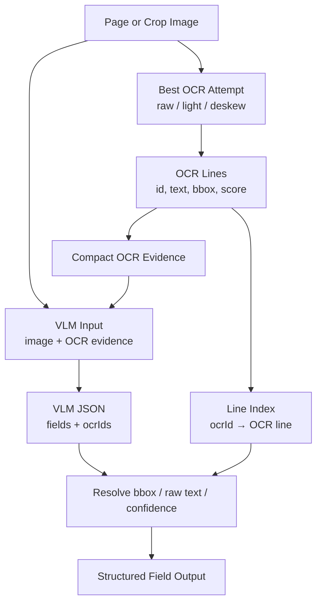
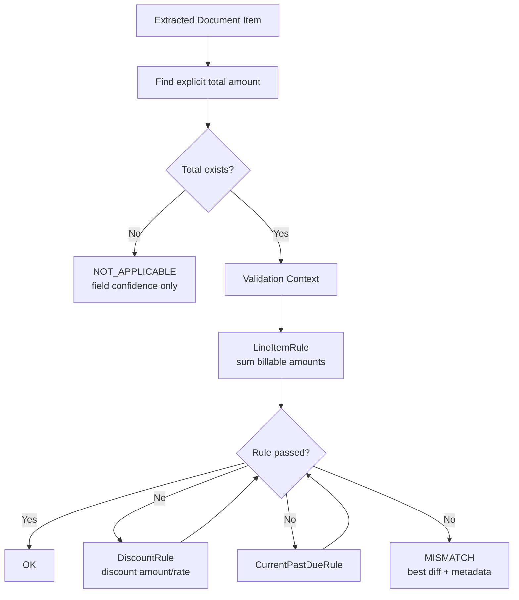
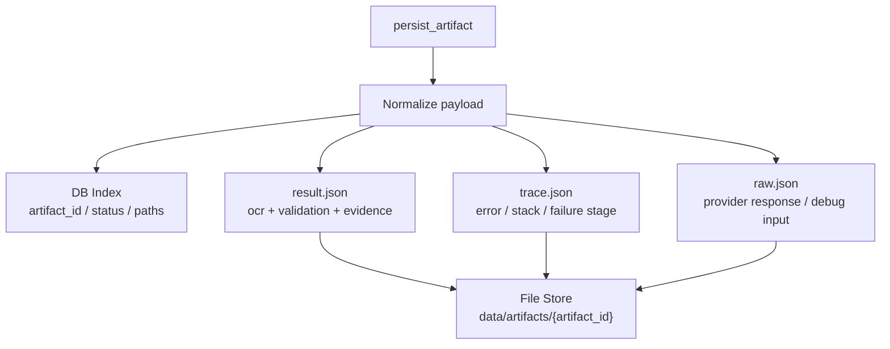

# AI-OCR Pipeline System Architecture

## 1. Portfolio Summary Architecture

```mermaid
flowchart LR
    Input["PDF / Image"] --> Preprocess["Preprocess<br/>render / split / rotate / enhance"]
    Preprocess --> OCR["PaddleOCR<br/>line text + score + bbox"]
    OCR --> Evidence["OCR Evidence<br/>ocrIds / text / bbox / confidence"]
    Evidence --> VLM["VLM Extraction<br/>structured fields + ocrIds"]
    VLM --> Restore["bbox / raw text restore"]
    Restore --> Validation["Validation Rules<br/>total / line item / discount"]
    Validation --> Artifact["Artifacts<br/>result.json / trace.json / raw.json"]
    Artifact --> History["History / Review / Integration"]
```

## 2. OCR Evidence + VLM Extraction Flow

## 3. Validation Rule Chain

## 4. Artifact Storage

## 5. Design Notes

- OCR은 line-level evidence를 만들고, VLM은 구조화된 field와 ocrIds를 반환합니다.
- 서버는 ocrIds를 기반으로 bbox, raw OCR text, confidence를 복원합니다.
- validation 결과와 원본 evidence를 artifact로 남겨 디버깅과 회귀 분석이 가능하도록 설계합니다.
- VLM 단독 추출보다 검증 가능성이 높고, OCR 단독 추출보다 문서 구조화에 유리합니다.

## 6. Improvement Ideas

- OCR 전처리 자동 선택
- 문서 유형별 validation rule 확장
- human review UI 연동
- validation failure dataset 구축
- OCR/VLM 결과 비교 benchmark 자동화
