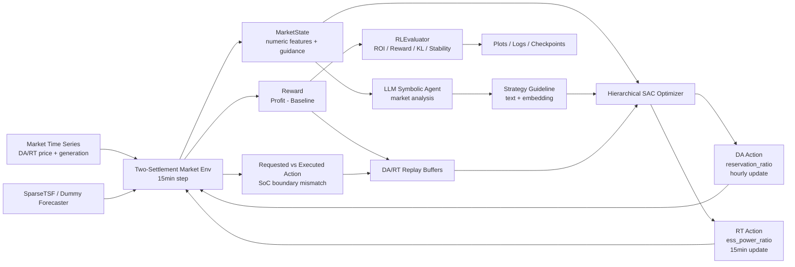
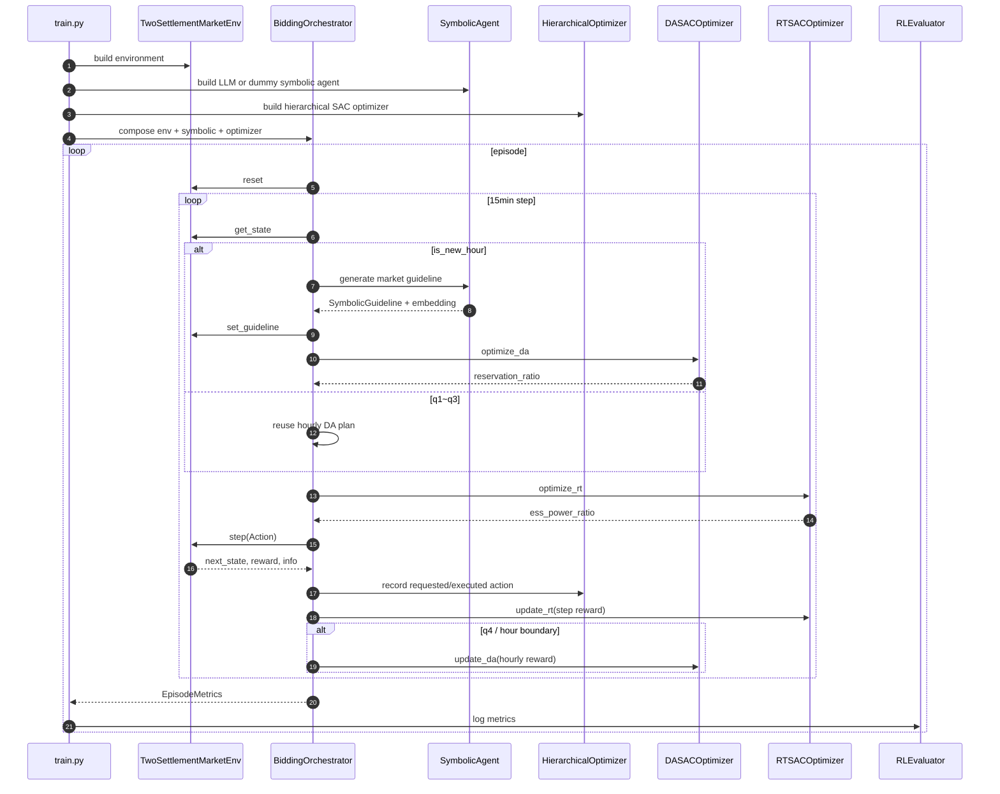
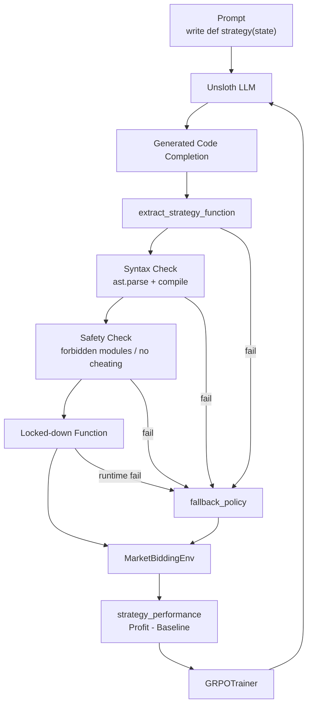
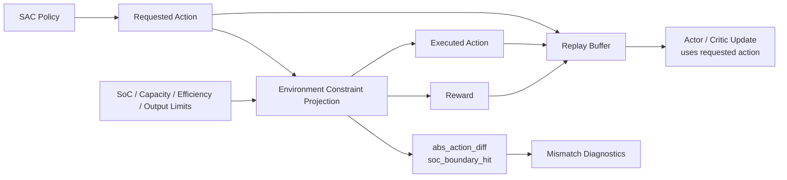

# Hybrid Symbolic RL System Architecture

## 1. Portfolio Summary Architecture

## 2. Hybrid Symbolic RL Flow

## 3. Initial GRPO Code Generation Attempt

## 4. Requested vs Executed Action Tracking

## 5. Design Notes

- 초기 GRPO 방식은 LLM이 직접 Python 전략 함수를 생성했기 때문에 문법 오류, 실행 오류, 안전성 검사가 필요했습니다.
- 개선된 구조에서는 LLM을 코드 생성자가 아니라 시장 해석과 전략 가이드 생성자로 제한했습니다.
- DA와 RT는 시간 해상도와 reward scale이 다르므로 별도 SAC optimizer와 replay buffer로 분리했습니다.
- 환경 제약 때문에 requested action과 실제 executed action이 달라질 수 있으므로 이를 별도로 기록했습니다.

## 6. Limitations

- 실제 LLM mode 전체 학습은 GPU 인식 환경에 의존합니다.
- 실제 시장 데이터, DA 계획 고정 제약, 발전소 운영 제약을 더 정교하게 반영해야 합니다.
- Reward scale과 DA/RT optimizer hyperparameter는 추가 튜닝이 필요합니다.
