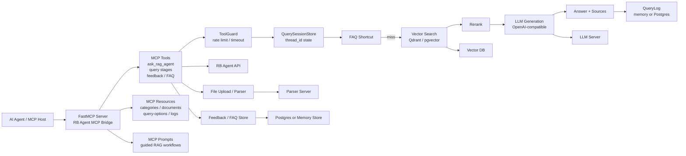
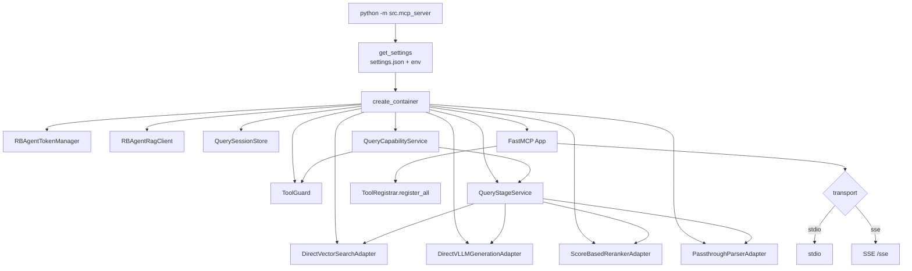
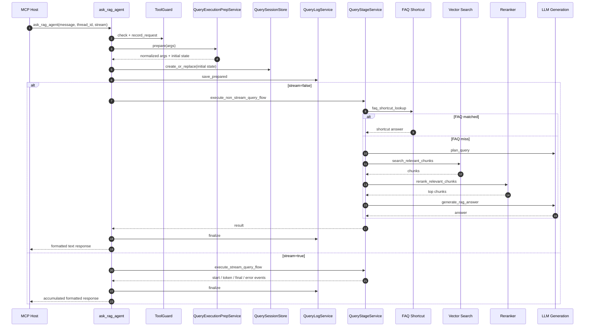
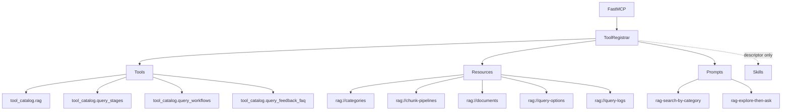
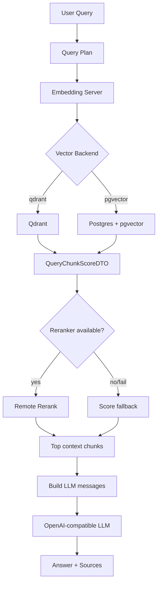
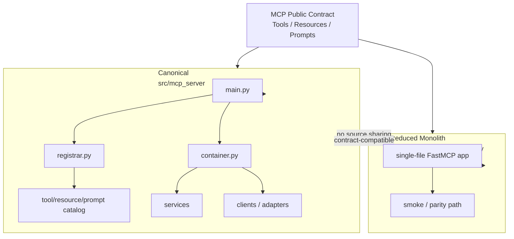

# MCP RAG Bridge System Architecture

## 1. Portfolio Summary Architecture

## 2. Runtime Wiring

## 3. Query Flow: ask_rag_agent

## 4. MCP Exposure Catalog

## 5. RAG Search and Generation

## 6. Canonical vs Monolith Reduced

## 7. Design Notes

- `src/mcp_server`는 canonical 구조이며 신규 기능은 이 경로에 우선 반영합니다.
- `src/monolith_reduced_main.py`는 독립적인 축약 구현이며 smoke test와 contract parity 확인 용도입니다.
- Tool/Resource/Prompt는 catalog module 단위로 명시 등록합니다.
- `QueryStageService`는 분해형 query primitive의 핵심 orchestration 계층입니다.
- `ask_rag_agent`는 formatted text를 반환하고, 분해형 tool은 dict payload를 반환합니다.
- Query log, feedback/FAQ, file metadata, query options는 memory 또는 shared Postgres backend로 교체 가능합니다.

## 8. Improvement Ideas

- public MCP tool contract 확정 후 documents/admin catalog 확장
- skill catalog를 runtime workflow descriptor로 활용
- adapter registry 기반 다중 agent routing 확장
- query evaluation / feedback loop 자동화
- production-grade session persistence 도입
