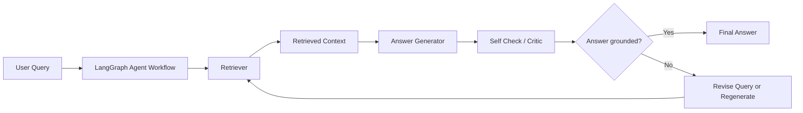
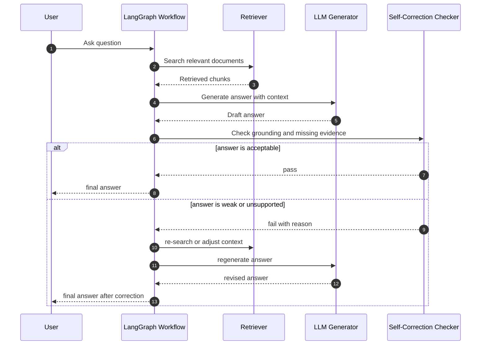

# Self-Correcting RAG System Architecture

## 1. Portfolio Summary Architecture

## 2. Detailed Flow

## 3. Design Notes

- RAG 응답을 바로 반환하지 않고 검증 단계를 둡니다.
- 검색, 생성, 검증, 재생성 단계를 LangGraph node로 분리합니다.
- 답변 품질 저하 원인은 근거 부족, 문서 불일치, 누락 정보, 질문 의도 오해로 나누어 볼 수 있습니다.
- 이 프로젝트는 환각을 완전히 제거하는 것이 아니라, 환각 가능성을 줄이기 위한 구조적 접근을 검토한 PoC입니다.

## 4. Improvement Ideas

- 평가 질문셋 구축
- Groundedness score 도입
- 답변-근거 문장 alignment 저장
- Human feedback 기반 재학습 또는 FAQ 승격 연동
