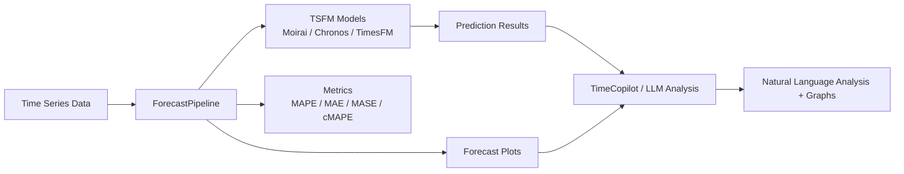
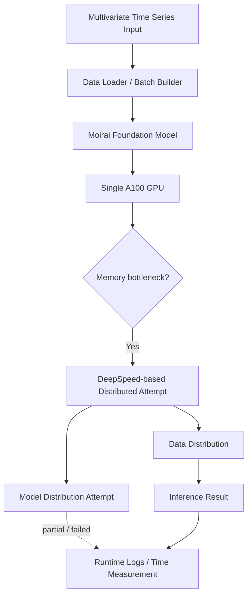
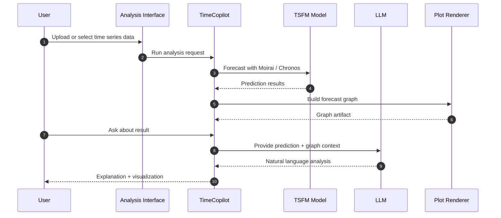

# Time Series AI Platform System Architecture

## 1. Portfolio Summary Architecture

## 2. Inference Optimization Architecture

## 3. TimeCopilot Analysis Flow

## 4. Design Notes

- 시계열 예측 결과를 단순 CSV나 그래프가 아니라 LLM 기반 분석 경험으로 확장하는 구조입니다.
- 대형 모델 추론에서는 GPU 메모리, batch 구성, model loading, device mapping이 병목이 될 수 있습니다.
- 모델 분산은 완전 성공하지 못했지만, 데이터 처리와 실행 파이프라인 개선으로 추론 시간 단축 성과를 만들었습니다.

## 5. Improvement Ideas

- 모델별 benchmark 자동화
- MLflow 기반 실험 추적
- GPU memory profiler 도입
- streaming/async inference queue 도입
- TimeCopilot 분석 결과를 API 서비스로 분리
